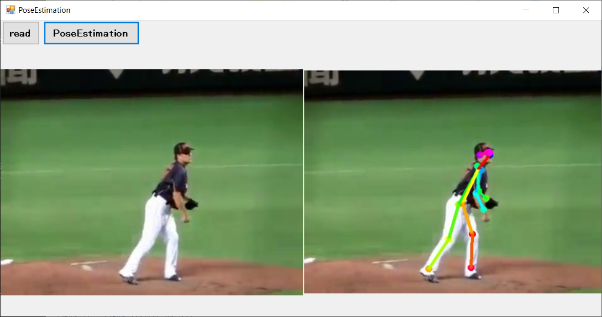

# tfPoseEstimation_app  


Windows application(EXE)  


----

## Make it a Windows application with pyinstaller  
**Windows10+Anaconda3**
## Requirements  
ImageMagick-7.0.10-Q16  

```
set PATH=%PATH%;"C:\Program Files\Git\bin"

#https://qiita.com/kayu0516/items/754c6719fb55d2a6d563 
conda install cython
conda install git
conda install swig
conda install opencv
```
```
conda install tensorflow==1.14
``` 
or 
```
conda install tensorflow-gpu==1.14
```
```
pip install "git+https://github.com/philferriere/cocoapi.git#egg=pycocotools&subdirectory=PythonAPI"

cd tf_pose\pafprocess
swig -python -c++ pafprocess.i && python setup.py build_ext --inplace
cd ..
cd ..

python setup.py install

cd models\graph\cmu
#bash download.sh
```
**download**
```
http://www.mediafire.com/file/1pyjsjl0p93x27c/graph_freeze.pb
http://www.mediafire.com/file/i72ll9k5i7x6qfh/graph.pb
http://www.mediafire.com/file/qlzzr20mpocnpa3/graph_opt.pb
```

**tensorRT comment out!**
```
tf_pose/estimator.py
```
line 14  -> import 
line 315 -- 328 

```
run.py
```
line 54 add -->    ```cv2.imwrite('output.jpg', image)```  
line 56 -- end --> comment out  


```
python run.py --model=mobilenet_thin --image=./images/p1.jpg
```
